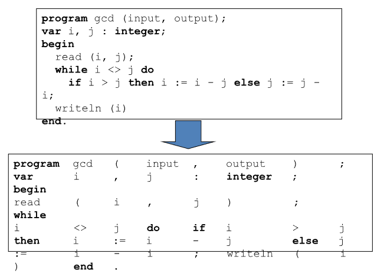
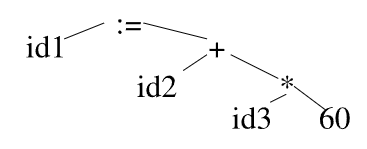
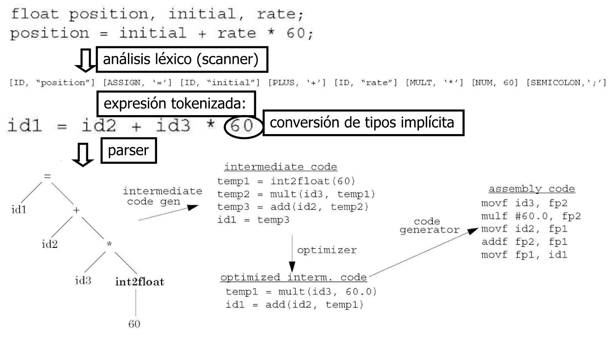
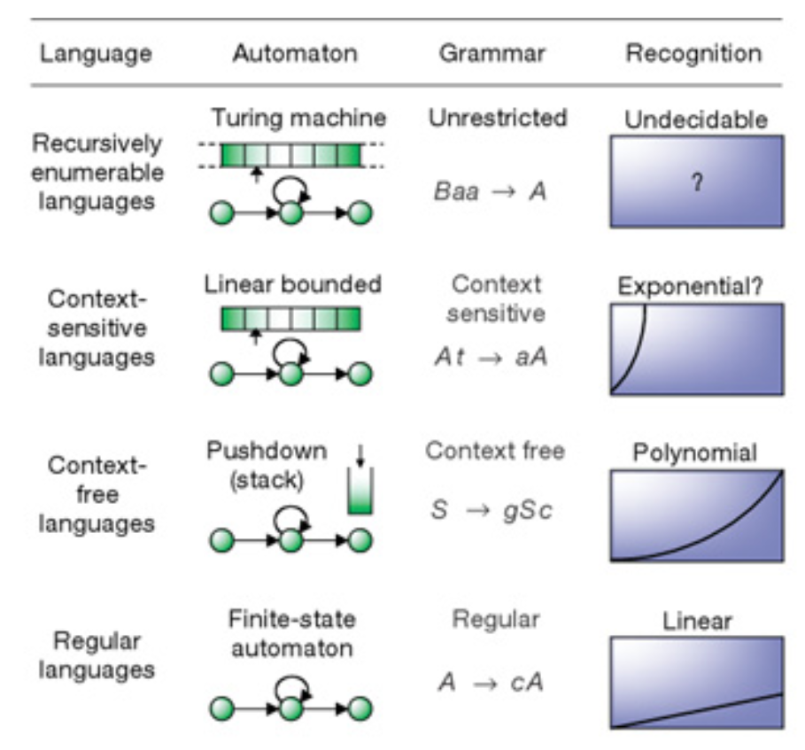
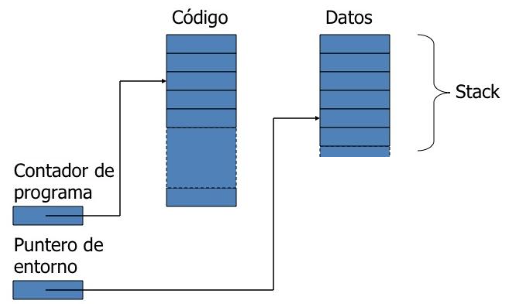
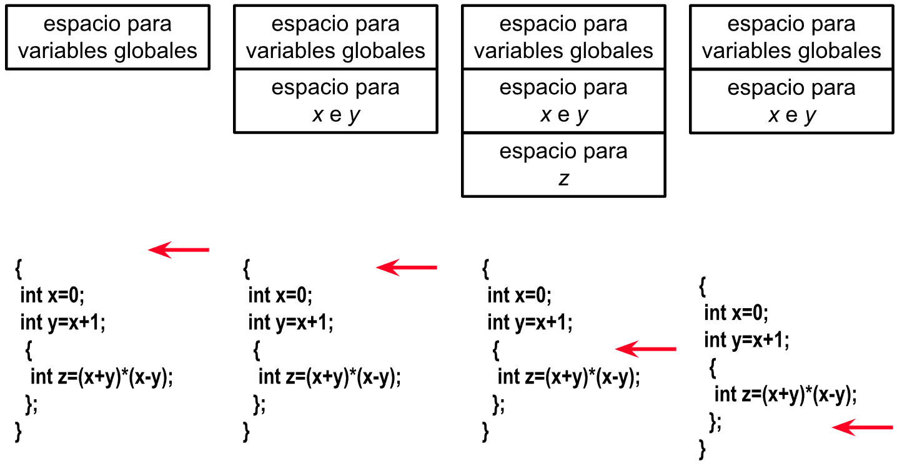

# Sintaxis y Semantica

## Sintaxis

* Un **Programa** es la descripción de un proceso dinámico
    
    - Lo que tiene que ver con la forma recibe el nombre de **Sintaxis**.

    - Lo que tiene que ver con el significado recibe el nombre de **Semántica**

* La **Implementación** de un lenguaje de programación debe transformar la sintaxis de un programa en instrucciones de máquina que se pueden ejecutar para que suceda la secuencia de acciones que se pretendía.

### Transformación de sintaxis a semántica

Un **lenguaje de programación** es un conjunto de abstracciones y empaquetamientos quizás sin correspondencia directa con la máquina.

* Es necesario **Traducir** lenguaje de programación a instrucciones de máquina, el **Compilador** es el que hace esa traducción (tambien se encarga de procesar la sintaxis de los lenguajes de programación).

* Un **Interprete** (Como el de python) puede combinar traducción y ejecución (incluye un compilador y la ejecución).

### ¿Qué es un Compilador?

Un programa que lee un programa escrito en lengujae origen y lo traduce a un programa equivalente (con el mismo significado) en un lenguaje destino.
<br/>Tiene dos componentes:

1) Entender el programa (asegurarse de que es correcto).

2) Reescribir el programa.

Normalmente, el lenguaje origen es de alto nivel y el destino es de bajo nivel.

### Fases de un compilador

* Análisis léxico.

* Análisis sintático.

* Análisis semántico.

* Generación de código intermedio (independiente de máquina).

* Optimización de código intermedio.

* Generación de código destino (dependiente de máquina).

* Optimización de código destino.

### Procesos de compilación

Programa origen, con macros ---> **Preprocesador** ---> Programa origen ---> **Compilador** ---> Programa en ensamblador destino ---> **Ensamblador** ---> Código máquina reubicable ---> **Linker** ---> Código máquina absoluto.

### Front-end y Back-end

* Front end análisis

Programa origen (cadena de caracteres) ---> [Scanner](#scanner-análisis-léxico) (análisis léxico) ---> Tokens ---> [Parser](#parser-análisis-sintático) (análisis sintático) ---> Árbol sintático ---> **[Análisis semántico](#análisis-semántico) y generación de [código intermedio](#código-intermedio)** ---> árbol sintáctico abstracto.

* Back end síntesis

Árbol sintáctico abstracto ---> **Optimización de código independiente de máquina** ---> Formaintermedia modificada ---> **Generación de código destino** ---> [código destino](#código-destino) ---> **Optimización de código dependiente de máquina** ---> Código destino modificado.

### Scanner: Análisis léxico

Se divide un programa (secuencia de caracteres) en palabras (Tokens).



### Parser: Análisis sintático

* Comprueba si la secuencia de tokens (palabras) conforma a la especificación gramatical del lenguaje y genera el árbol sintáctico.

* La especificación gramatical suele representarse con una gramática independiente de contexto (*Context free grammar*), que también le da forma al árbol sintáctico.

### Gramáticas independientes de contexto

* Se definen **Categorias de construcciones del lenguaje**, por ejemplo:

    - **Sentencias** (*Statements*)

    - **Expresiones** (*Expressions*)

    - **Declaraciones** (*Declarations*)

```
<statement>     ::= <for-statement> | <if-statement> | <assigment>
<for-statement>     ::= for(<expression>; <expression>; <expression>) <statement>
<assignment>    ::= <identifier> := <expression>
```

### Ejemplo: Micro Pascal

```
<Program>    ::= program <id> (<id> <More_ids>); <Block>.
<Block>    ::= <Variables> begin <Stmt> <More_Stmts> end
<More_ids>    ::= , <id> <More_ids>
    | ε
<Variables>    ::= var <id> <More_ids> : <Type> ; <More_Variables>
    | ε
<More_Variables>    ::= <id> <More_ids> : <Type> ; <More_Variables>
    | ε
<Stmt>    ::= <id> := <Exp>
    | if <Exp> then <Stmt> else <Stmt>
    | while <Exp> do <Stmt>
    | begin <Stmt> <More_Stmts> end
<Exp>    ::= <num>
    | <id>
    | <Exp> + <Exp>
    | <Exp> - <Exp>
```

### Ejemplo de análisis sintáctico

`id1 := id2 + id3 * 60`



### Análisis Semántico

* El compilador trata de ver si un programa **Tiene sentido** analizando su árbol sintáctico.

* Un programa sin errores gramaticales no siempre es correcto, puede haber problemas de tipo

`pos = init + rate * 60`

* ¿Qué pasa si `pos` es una clave y `init` y `rate` sin enteros? 

    - El parser no puede encontrar este tipo de errores.

    - El análisis semántico encuentra este tipo de errores.

* El compilador hace comprobaciones semánticas **estáticas** (*static semantic checks*):

    - Comprobación de tipos.

    - Declarcación de variables antes de su uso.

    - Se usan los identificadores en contextos adecuados.

    - Comprobar argumentos.

    - Si hay un fallo en compilación, se genera un **error**.

* En **Tiempo de Ejecución** (*dynamic semantic checks*) se comprueba:

    - Que los valores de los arreglos estén dentro de los límites.

    - Si hay errores aritméticos (división por 0 por ejemplo).

    - Que no se desferencian los punteros si no apuntan a un objeto válido.

    - Si se usan variables sin inicialización.

    - Si hay un fallo en ejecución, se levanta una **Excepción**.

### Tipado Fuerte

* Un lenguaje tiene **Tipado Fuerte** si siempre se detectan los errores de tipo:

    - En tiempo de compilación o de ejecución.

    - Ejemplo de lenguajes con tipado fuerte: Ada, Java, ML, Haskell.

    - Ejemplo de lenguajes con tipado débil: Fortran, Pascal, C/C++, Lisp.

    - *duck typing*: Python.

* El tipado fuerte hace que el lenguaje sea más seguro y fácil de usar sin errores, pero potencialmente más lento por las comprobaciones dinámicas.

* En algunos lenguajes algunos errores de tipo se detectan tarde, lo que hace poco fiables (Basic, Lisp, Prolog, lenguajes de scripting).

### Código Intermedio

El **Código Intermedio** está cerca de la máquina pero sigue siendo fácil de manipular, para poder implementar optimizaciones. Por ejemplo:

```
temp1 = 60
temp2 = id3 + temp1
temp3 = id2 + temp2
id1 = temp 3
```
Se puede optimizar (independientemente de máquina):

```
temp1 = id3 * 60.0
id1 = id2 + temp1
```

### Código Destino

* De la forma independiente de máquina se genera ensamblador:

```assembly
MOVF id3, R2
MULF #60.0, R2
MOVF id2, R1
ADDF R2, R1
MOVF R1, id1
```

* Este código específico de máquina se optimiza para explotar características de hardware específicas.

### Ejemplo de compilación de una expresión



---

## Gramáticas

### Jerarquía de Chomsky



### Gramática independiente de contexto

Vamos a estar usando **gramáticas independiente de contexto** (CFG, *context-free grammars*), aunque algunas propiedades de los lenguajes de programación escapan a su expresividad

### Gramáicas y Árboles sintácticos

**¿Qué es una gramática?**

* Es un método para:

    - Definir conjuntos finitos de expresiones.

    - Procesar expresiones.

* Consiste de:

    - símbolos inicial.

    - No terminales.

    - Terminales.

    - Producciones.

### Gramática del lenguaje de expresiones numéricas

```
e ::= n | e + e | e - e
n ::= d | nd
d ::= 0 | 1 | 2 | 3 | 4 | 5 | 6 | 7 | 8 | 9
```

Expresiones:

```
0
1 + 3 - 5
2 - 28 + 347598
```

### Gramáticas como métodos

* No terminales:

    - Forma adecuada de describir la composicionalidad de las expresiones.

    - No pueden formar parte de una expresión, siempre se tiene que substituir por terminales.

* Derivación: Secuencia de sustituciones que termina en una cadena de terminales

```
e -> n -> nd -> dd -> 2d -> 25

e -> e-e -> e+e -> ... -> n-n+n -> ... -> 10-15+12
```

## Semántica

### Lenguaje objeto y metalenguaje

* El **Metalenguaje** es el que usamos para hablar de un **lenguaje objeto**.

* Necesitamos un lenguaje para hablar de la semántica de los lenguajes de programación.

### Delimitación de la semántica de los lenguajes de programación

* Los programas pueden definir **Funciones parciales**

    - Algunos de sus valores pueden ser **indefinidos** (Por ejemplo si no terminan).

    - Algunos de sus valores pueden ser **errores**.

* Una función es computable si hay algún programa que la computa

    - Problema: Definiciones independientes de la implementación de un lenguaje de programación concreto, con sus limitaciones y particularidades.

### ¿Cómo definir la clase de funciones computable?

* Una clase de funciones matemáticas: las **Funciones recursivas parciales** (Church).

* Las que computar con una máquina idealizada, abstracta: la **Máquina de Turing**:

    - Cinta infinita, divida por celdas.

    - Un cabezal de lectura/escritura.

    - Un controlador de estado finito.

* Si se puede expresar en **Labbda cálculo**.

### Diferentes aproximaciones a la semántica 

* Lambda cálculo.

* Semántica denotacional.

* Semántica operacional.

### Semántica operacional

* Una representación abstracta de la ejecución de un programa, como secuencia de transiciones entre estados (en una máquina abstracta).

* Los estados son una descripción abtracta de la memoria y estructuras de datos.

* Las transiciones siguen la estructura de la sintaxis.

### Máquina Abstracta



### Información en la máquina abstracta

* Separa memoria de código y de datos:

    - **Contador de programa**: Es una dirección de memoria con la instrucción que se está ejecutando.

    - **Puntero de entorno**: Valores de las variables en una parte del código.

* **Lenguaje no estructurado por bloques**: La memoria de datos es no estructurada, los valores de las variables son visibles desde todo el código.

* **Lenguaje estructurado por bloques**: **Pila de ejecución** o **Stack**. Cuando el programa entra en un nuevo bloque, se agrega a la pila un **Activation record** con espacio para las variables locales del bloque, el puntero de entorno apunta al nuevo activation record. Cuando el programa sale del bloque, se retira el activation record de la pila y el puntero de entorno se restablece a su ubicación anterior.

### Pila de ejecución

* Los registros de activación se guardan en la pila

    - Cada nuevo bloque apila (*push*) un nuevo regristro de activación en la pila.

    - Cada vez que se termina un bloque se saca (*pop*) el registro de arriba de la pila.

    - La pila tiene todos los registros que son activos en un determinado momento de la ejecución, con el que se usó más recientemente en la punta.

### Registros de activación o Marcos de pila (Activation Record o Stack Frames)

* Guarda información de un bloque:

    - Variables locales.

    - *Control link* al que ha llamado al activation record, para reubicar el puntero de entorno.

    - Variables temporales y resultados intermedios.

* Entran y salen de la pila (*Stack*), eso hace que se puedan usarse llamados anidados/recursivos.

### Ejemplo de la pila de ejecución



### Otro ejemplo de pila de ejecución

* `fact(3)`

    1) Apila un registro, llama a `fact(2)`.

    2) Esta llamada apila otro registro, llama a `fact(1)`.

    3) Esta llamada apila otro registro, de forma que hay tres registros en la pila.

    4) Cuando se termina de ejecutar el bloque de registro más reciente, se saca ese registro de la pila.

    5) y así sucesivamente hasta que la pila queda vacía.