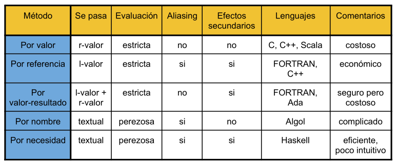

# Conceptos construídos sobre los más fundamentales

# Pasaje de Parametros

## Argumentos y parámetros

* **Argumento**: expresión que aparece en una **Llamada** a función.

* **Parámetro**: identificador que aparece en la **Declaración** de una función.

* La ¿Correspondencia? entre parámetros y argumentos es por número y posición.

## Mecenismos de pasaje de parámetros

* [Por valor](#pasaje-por-valor)

* [Por referencia](#pasaje-por-referencia)

* [Por valor-resultado](#pasaje-por-valor-resultado)

* [Por nombre](#pasaje-por-nombre)

* [Por necesidad](#pasaje-por-necesidad)

## Pasaje por valor

* La función que llama pasa el **r-valor** del argumento a la función que es llamada

    - Se computa el valor del argumento en la llamada
    
    - No hay "*aliasing*" (es decir, dos identificadores para una sola ubicación en memoria)
    
* La función no puede cambiar el valor de la variable de la función que llama

## Pasaje por refencia

* La función que llama pasa el **l-valor** del argumento aq la función que es llamada.

    - Se asigna la dirección de memoria del argumento al parámetro.
    
    - Causa "*aliasing*"
    
* La función puede modificar la variable de la función que llama.

* Ejemplo en `C++`

    - El "tipo referencia" indica que el l-valor se pasa como argumento
    
    ```
    void swap (int& a, int& b){
        int temp = a;
        a = b;
        b = temp;
    }
    ```
    
    - `int& a`, `int& b` los l-valores para los tipos referencia en `C++` se determina totalemnte en tiempo de compilación.
    
    - El operador `&` está sobrecargando en `C++`:
        
        * Cuando lo aplicamos a una variable, nos da si l-valor.
        
        * Cuando lo aplicamos a un tipo en una lista de parámetros, significa que queremos pasar el argumento por referencia.
        
* Existe dos formas de pasar por referencia

    1) `C` o `C++`

```c
void swap(int *a, int *b) {
    int temp = *a;
    *a = *b;
    *b = temp;
}

int x = 3, y = 4;
swap(&x, &y);
```
    
    2) solamente `C++`

```c++
void swap (int& a, int& b) {
    int temp = a;
    a = b;
    b = temp;
}

int x = 3, y = 4;
swap(x, y);
```

## Comparacion valor-referecia

* En el caso de trabajar con estructuras de datos grandes, ¿Cuál es la opción más económica?

* ¿Cuál es la opción que puede tener efectos secundarios?

* En lenguajes funcionales no hay diferencias entre **pasaje por referencia** y **pasaje por valor**, ¿Why?

## Pasaje por valor-resultado

* Intenta tener beneficios de llamada por referencia (efecto secundarios en los argumentos) sin los problemas de *aliasing*.

* Hace una copia en los argumentos al principio, copia las variables locales a los propios argumentos al final del procedimiento, de forma que se modifican los argumentos.

* WARNING: el comportamiento depende del orden en que se copian las variables locales.

## Pasaje por nombre

* En el cuerpo de la función se sustituye textualmente el argumento para cada instancia de su parámetro.

* es un ejemplo de ligado tardío

    - La evaluación del argumento se posterga hasta que efectivamente se ejecuta en el cuerpo de la función.
    
    - Asociado a evualuación perezosa en lenguajes funcionales (por ejemplo: Haskell)
    
## Pasaje por necesidad

* Variación de *call-by-name* donde se guarda la evaluación del parámetro después del primer uso.

* Idéntico resultado a *call-by-name* (y más eficiente!!!) si no hay efectos secundarios.

* El mismo concepto que *lazy evaluation*.

## Resumen



---

# Alcance y clausura

## Reglas de alcance

```c
| { int x = 0;
|       int y = x + 1;   
|           | { int z = (x + y) * (x - y);
|           | };
| };
```

`x`, `y` son variables locales al bloque exterior. Son libres al bloque interior

`z` es local al bloque interior

* **Alcance estatico**: El valor de las variables globales se obtiene del bloque inmediatamente contenedor.

* **Alcance dinamico**: El valor de las variables globales se obtiene del activation record más reciente.

## Clausura (estaticas)

* El valor de una funcion es el par `clausura = <entorno, codigo>`

    - La idea es que una funcion con alcance estatico lleva un link a su environment estatico.

* Llamada a una funcion con clausura

    - Aloja el activation record para la llamada

    - Fija el acces link del activation record usando el puntero de entorno de la clausura.

## Funciones de alto orden

* Una funcion puede ser argumento o resultado de otra funcion

    - Se necesita un puntero al registro de activacion mas arriba en la pila

    - Pueden surgir problemas especialmente al pasar una funcion como argumento

## Devolver funciones como resultado

* No todos los lenguajes tiene esta posibilidad

* Funciones que devuelven nuevas funciones

* `fun compose(f, g) = (fn x => g(f x));`

    - Se pueden crear funciones de forma dinámica, con valores instanciados en tiempo de ejecución (lo que conociamos como generalizaciones)

    - El valor de una funcion es la `clausura = <env, codigo>`

    - El codigo no se compila dinámicamente en casi ningun lenguaje

    - Necesitamos mantener el entorno de la funcion que genero la funcion dinamica.

# Recursion a la cola

* La funcion `g` hace una **llamada a la cola** a la funcion `f` si el valor de retorno de la funcion `f` es el valor de retorno de `g`.

* Ejemplo:

`fun g(x) = if x > 0 then f(x) else f(x) * 2`

El primer `f(x)` es llamada a la cola, el segundo no

* Optimizacion: Se puede desapilar el activation record actual en una llamada a la cola

    - especialmente util para llamadas a la cola recursivas porque el siguiente activation record tiene exactamente la misma forma.

## Como convertir una funcion recursiva en iterativa


