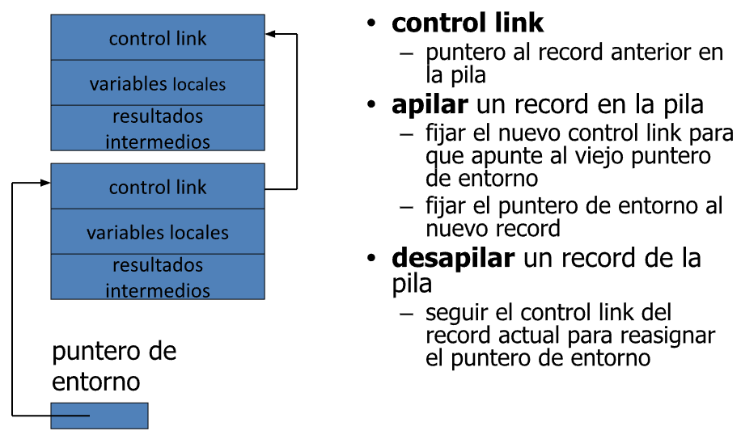
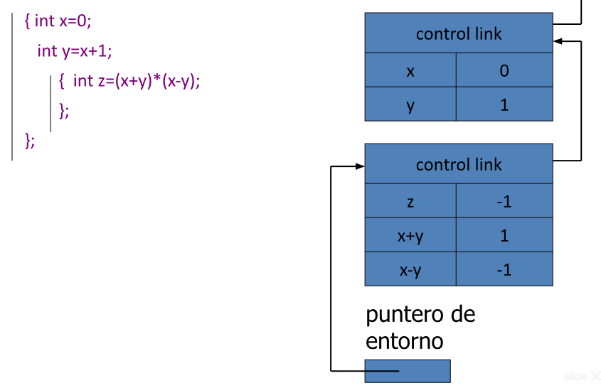
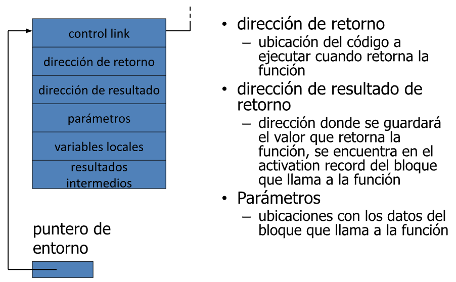
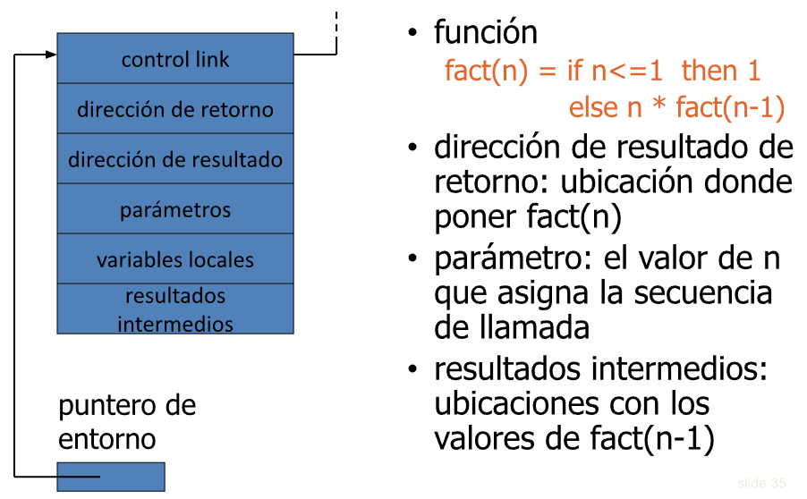
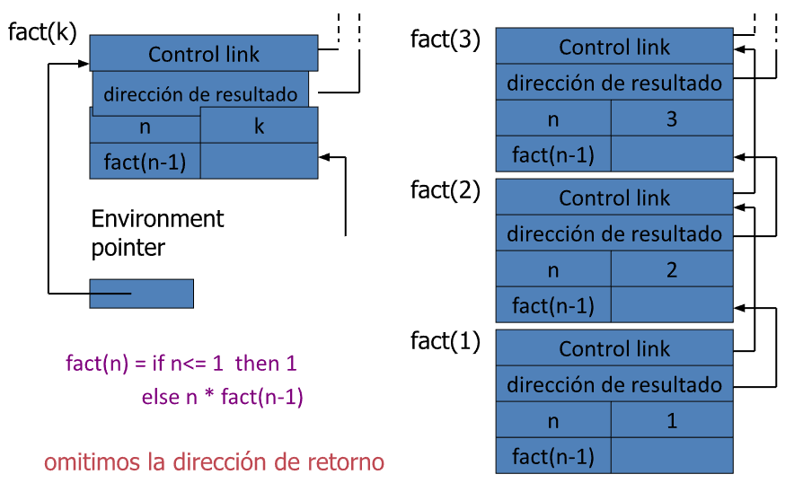
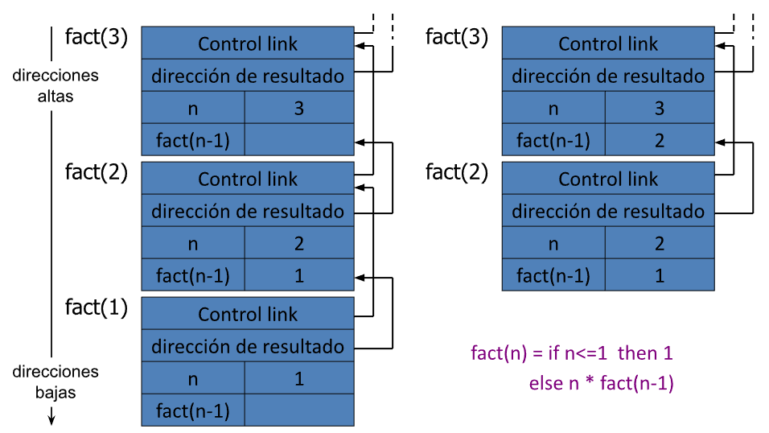

# Conceptos Fundamentales de Lenguajes imperativos

## Paradigma Imperativo

* Un **paradigma** de programacion es una **configuracion frecuente** (y **feliz** xd) de caracteristicas de lenguajes de programacion.

* El **paradigma imperativo** es el mas antiguo y el que estuvo siempre mas pegado a la maquina.

* Tradicionalmente se ha opuesto al **paradigma funcional**, pero la mayor parte de lenguajes integran ideas de ambos paradigmas.

### Conceptos Fundamentales

* Operaciones basicas: **Asignacion**

    - La asignaciopn tiene efectos secundarios: cambia el estado de la maquina

* Sentencias de **control** de flujo

    - Condicionales y sin condicion (GO TO), ramas, ciclos.

* Bloques, para obtener **Referencias locales**.

* **Parametrizacion**.

### Elementos Basicos

* Definicion de **tipos**.

* [Declariciones de **Variables**](#declaraciones-de-variables) (Normalmente, tipadas).

* [Expresiones y sentencias de **Asignacion**](#expresiones-y-sentencias-de-asignacion).

* [Sentencias de **Control de flujo**](#sentencias-de-control-de-flujo) (normalmente, estructuradas).

* [**Alcance léxico** y bloques, para poder tener variables con referencia locales](#alcance-lexico-y-bloques).

* [Declarciones y definiciones de **Procedimientos** y **Funciones**](#declarciones-y-definiciones-de-procedimientos-y-funciones) (bloques parametrizados).

---

## Declaraciones de Variables

* Las declaraciones **Tipadas** restringen los posibles valores de una variable en la ejecución del programa

    - Jerarquía de tipos *built-in* o personalizada.

    - Inicializacion.

* Uso de memoria: ¿Cuanto espacio de memoria reserva para cada tipo de variable?

    - C en 32-bit: `char` = 1 byte, `short` = 2 bytes, `int` = 4 bytes, `char*` = 4 bytes.

### Ubicacion y valores de variables

* Al declarar una variable la estamos ligando a una **Ubicacion en memoria** (global, en la pila o en el heap).

* **l-valor**: Ubicacion en memoria (direccion de memoria).

* **r-valor**: valor que se guarda en la ubicacion de memoria identificada por el l-valor.

* **Identificador**: nombre de la variable en el texto del programa.

---

## Expresiones y sentencias de asignacion

### Variables y asignacion

En la parte derecha de una asignacion esta el r-valor de la variable, en la parte izquierda esta su l-valor.

* `x:= 1` significa "guardemos **1** como r-valor de la ubicacion señalada por el l-valor ligado a x".

* `x:= x+1` significa "obtengamos el r-valor que encontramos en el l-valor ligado al identificador de variable x, sumémosle 1, y guardemos el resultado como r-valor de la ubicacion señalada por el l-valor ligado a x".

* Una expresion que no tenga un l-valor no puede aparecer en la parte izquierda de una asignacion.

* ¿Que expresiones no tienen l-valor?

    - `1 = x+1`, `++x++`.

    - `a[1] = x+1`

* El r-valor de un puntero es el l-valor de otra variable (el valor de unpuntero es una direccion).

* Las constantes sólo tienen r-valor.

* El nombre de una funcion solo tiene l-valor.

### l-valor y r-valor en C: punteros

* &x devuelve el l-valor de x.

* *p devuelve el r-valor de p.

    - Si p es un puntero, esto es el l-valor de otra variable.

---

## Sentencias de control de flujo

### Flujo de control estructurado

* Se piensa como secuencial

    - Las instrucciones se ejecutan en el orden en el que estan escritas.

    - En algunos casos soporta ejecucion concurrente.

* Un programa es **Estructurado** si el flujo de control es evidente en la estructura sintactica del texto del programa

    - Util para poder razonar intutivamente leyendo el texto del programa.

    - Se crean construcciones del lenguaje para patrones comunes del control: Iteracion, seleccion, procedimiento / funciones.

### Estructura de control en Fortran

```
10 if (X.GT. 0.000001) GO TO 20
11 X = -X
   if(X.LT. 0.000001) GO TO 50
20 if (X*Y .LT. 0.000001) GO TO 30
   X = X-Y-X
30 X = X+Y
   ....
50 CONTINUE
   X = A
   Y = B-A
   GO TO 11
   ....
```
Codigo Espagueti

En una estructura parecida puede aparecer en ensamblador

---

## Alcance lexico y bloques

### Estilo Moderno

* Construcciones estandar que estructuran los saltos

    - `if...then...else...end`

    - `while...do...end`

    - `for...{...}`

    - `case...`

* Agrupan el codigo en bloques logicos.

* Se evitan saltos explicitos (excepto retorno de funcion).

* No se puede saltar al medio de un bloque o funcion.

### Lenguaje con estructura de bloques

* Bloques aninados con variables locales

```

        |--{ int x = 2;
        |    { int y = 3  ---|
Bloque  |                    | bloque interior
exterior|        x = y + 2   |
        |    }            ---|
        |--}
```
(x e y se declaran nuevas variables en los bloques anidados)

* Manejo de memoria

    - Al entrar al bloque reservamos espacio para variables.

    - Al salir del bloque se puede liberar parte o todo el espacio.

### Bloques en Lenguajes Comunes

* C ---> `{...}`

* Algol ---> `begin ... end`

* ML ---> `let ... in ... end`

* Existen dos tipos de bloques:

    - Inline

    - Bloques asociados con funciones o procedimientos.

### Iteración

* Definida

```
for (int i = 0; i < 10; i++){
    a[i] = 0;   // intialize each array element to zero
}
```

* Indefinida

    - La iteracion depende de un valor dinámico (calculando en tiempo de ejecución)

```
int m = 0;
while (n > 0) {
    m = n * n;
    n = n - 1;
}
```

---

## Manejo de Memoria

* El **Stack** tiene los datos sobre entrada y salida de bloques.

* El **Heap** tiene datos de diferentes lifetine.

* El **Puntero de entorno** (*environment*) apunta a la posicion actual en el stack.

* Al entrar a un bloque: se añade un nuevo activation record al stack.

* Al salir de un bloque: se elimina al activation record más reciente del stack.

---

## Alcance y lifetine

* **Alcance**: region del texto del programa donde una declaración es visible.

* **Lifetine**: periodo de tiempo en que una ubicacion de memoria es asignada a un programa.

Por ejemplo:

```
{ int x = ...;
    { int y = ...;
        { int x = ...;
            ...
        };
    };
};
```

La declaración mas interior de `x` tapa a la mas exterior ("Hueco en el alcance"). El lifetime de la declaracion exterior incluye el tiempo en el que el bloque interior se ejecuta

---

## Activation Records

* Para cada **Bloque** se usa un activation record.

    - **Estructura de datos** que se guarda en la pila de ejecucion.

    - Tiene lugar para **Variables Locales**

```
|{ int x = 0;                       | apilar record con espacio para x, y fijar
|    int y = x + 1;                 | valores de x, y
|                                   |   | apilar record para bloques interno
|    |{ int z = (x + y) * (x - y);  |   | fijar valor de z
|    |                              |   | desapilar record para bloque interno
|    |};                            | desapilar para bloque externo
|};                                 |
```

---

## Activation Record para bloque inline



### Ejemplo



---

## Declarciones y definiciones de **Procedimientos** y **Funciones**

### Abstracción procedural

* Un procedimiento es un **Alcance parametrizado con nombre**

    - El programador se puede abstraer de los detalles de implementación, enfocándose en la interfaz.

* Funciones que **Retorna valores**

`x = (b * b - sqrt(4 * a * c)) / 2 * a`

* Funciones que **NO retorna valores**

    - "Procedimientos" (Ada), "subrutinas" (Fortran), "Funciones vacías / métodos" (C, C++, Java).

    - Tienen **Efectos secundarios visibles**, cambian el estado de algun valor de datos que no se define dentro de la funcion.

`strcpy(s1, s2)`

### Activation Records para funciones

* Informacion de bloque ("frame") asociado a cada llamada de funcion:

    - Parametros.

    - Variables locales.

    - Direccion de retorno.

    - Ubicacion para el valor de retorno al finalizar la funcion.

    - Control link al activation record de quien la llamo.

    - Registros guardados.

    - Variables temporales y resultados intermedios.

    - (no siempre) access link al padre estático de la funcion.

### Esquema de activation record



### Ejemplo



### Pila de ejecución

Los registros de activacion se guarda en la pila

* Cada nueva llamada apila un activation record.

* Cada llamada finalizada desapila al activation record de la punta.

* La pila tiene todos los records de todas las llamadas activas en un momento de la ejecución, siendo el record de la punta la llamada más reciente.

Ejemplo: `fact(3)`

* Apila un activation record a la pila, llama a `fact(2)`

* Esta llamada apila otro record, y llama a `fact(1)`

* Esta llamada apila otro record, lo cual resulta en tres activation records en la pila.

### Llamada de funcion



### Retorno de funcion

