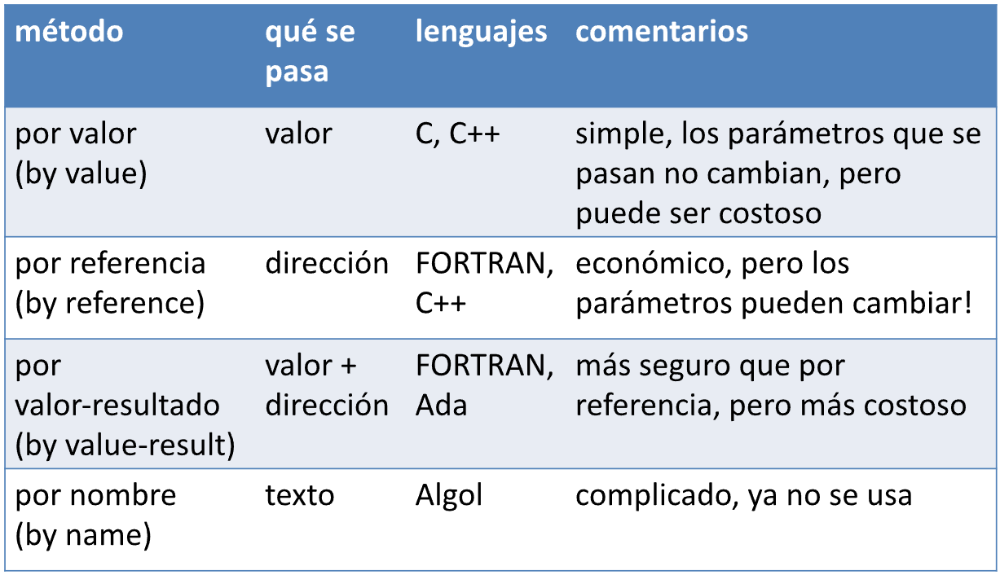

# Pasaje de parametros

Se diferencian por el momento en el que evalúa el parámetro real (**estricta** si es al momento de pasar el parámetro, **perezosa** si se evalúa cuando se lo necesita) y por donde se almacena el valor del parámetro resultado (la misma ubicación del bloque que hace la llamada a la función, o una nueva ubicación (**efectos secundarios**, puntero))

## Argumentos y parámetros

* **Argumento**: expresión que aparece en una **Llamada** a función.

* **Parámetro**: identificador que aparece en la **Declaración** de una función.

* La Correspondencia entre parámetros y argumentos es por número y posición.

## Mecenismos de pasaje de parámetros

* [Por valor](#pasaje-por-valor)

* [Por referencia](#pasaje-por-referencia)

* [Por valor-resultado](#pasaje-por-valor-resultado)

* [Por nombre](#pasaje-por-nombre)

* [Por necesidad](#pasaje-por-necesidad)

## Pasaje por valor

* La función que llama pasa el **r-valor** del argumento a la función que es llamada

    - Se computa el valor del argumento en la llamada
    
    - No hay "*aliasing*" (es decir, dos identificadores para una sola ubicación en memoria)
    
* La función no puede cambiar el valor de la variable de la función que llama

## Pasaje por refencia

* La función que llama pasa el **l-valor** del argumento aq la función que es llamada.

    - Se asigna la dirección de memoria del argumento al parámetro.
    
    - Causa "*aliasing*"
    
* La función puede modificar la variable de la función que llama.

* Ejemplo en `C++`

    - El "tipo referencia" indica que el l-valor se pasa como argumento
    
    ```
    void swap (int& a, int& b){
        int temp = a;
        a = b;
        b = temp;
    }
    ```
    
    - `int& a`, `int& b` los l-valores para los tipos referencia en `C++` se determina totalemnte en tiempo de compilación.
    
    - El operador `&` está sobrecargando en `C++`:
        
        * Cuando lo aplicamos a una variable, nos da si l-valor.
        
        * Cuando lo aplicamos a un tipo en una lista de parámetros, significa que queremos pasar el argumento por referencia.
        
* Existe dos formas de pasar por referencia

1) `C` o `C++`

```c
void swap(int *a, int *b) {
    int temp = *a;
    *a = *b;
    *b = temp;
}

int x = 3, y = 4;
swap(&x, &y);
```
    
2) solamente `C++`

```c++
void swap (int& a, int& b) {
    int temp = a;
    a = b;
    b = temp;
}

int x = 3, y = 4;
swap(x, y);
```

## Comparacion valor-referecia

* En el caso de trabajar con estructuras de datos grandes, ¿Cuál es la opción más económica?

* ¿Cuál es la opción que puede tener efectos secundarios?

* En lenguajes funcionales no hay diferencias entre **pasaje por referencia** y **pasaje por valor**, ¿Why?

## Pasaje por valor-resultado

* Intenta tener beneficios de llamada por referencia (efecto secundarios en los argumentos) sin los problemas de *aliasing*.

* Hace una copia en los argumentos al principio, copia las variables locales a los propios argumentos al final del procedimiento, de forma que se modifican los argumentos.

* WARNING: el comportamiento depende del orden en que se copian las variables locales.

## Pasaje por nombre

* En el cuerpo de la función se sustituye textualmente el argumento para cada instancia de su parámetro.

* es un ejemplo de ligado tardío

    - La evaluación del argumento se posterga hasta que efectivamente se ejecuta en el cuerpo de la función.
    
    - Asociado a evualuación perezosa en lenguajes funcionales (por ejemplo: Haskell)
    
## Pasaje por necesidad

* Variación de *call-by-name* donde se guarda la evaluación del parámetro después del primer uso.

* Idéntico resultado a *call-by-name* (y más eficiente!!!) si no hay efectos secundarios.

* El mismo concepto que *lazy evaluation*.

## Resumen

 

* En lenguajes funcionales al no haber asignación destructiva, da lo mismo usar pasaje por valor o por referencia, o usar pasaje por nombre que por necesidad. Además, recordar que como constantes no tienen l-valor no pueden ser llamadas como parámetros por referencia o por valor-resultado.

* En POO existe el ***call-by-sharing***, que es un **pasaje por valor** pero que mantiene una **referencia** a un objeto, por lo que si el objeto cambia ese cambio le puede afectar al parámetro objeto (usado por Java, Python, Ruby, Javascript).

* El **pasaje por valor** al realizar una copia de los argumentos (y ejecutar por valor hasta el return), es costoso para cosas grandes.

* El **pasaje por necesidad** es como el **pasaje por nombre** pero si algo se calcula, guarda el resultado para evitar re calcular posibles futuras llamadas

* El **pasaje por referencia** no puede aceptar parámetros no biyectivos (como “n+m”) porque después no sabría qué valor asignarles a cada uno en caso de asignación dentro de la función.

# Alcance y clausuras

## Reglas de alcance

* **Alcance estatico** (lexico): El valor de las variables globales se obtienen del bloque inmediantamente contenedor. Se busca al identificador con ese nombre declarado en el lugar más cercano al texto (bloque) actual del programa en un bloque que lo contenga. Usa la relación entre los **bloques** (***access link***). Más usado. El reemplazo de la variable por su valor se da en tiempo de **compilación**.

* **Alcance dinamico**: el valor de las variables globales se obtienen del activation record mas reciente. Se busca al identificador con ese nombre, declarado en el ***activation record*** más cercano (subiendo por la pila). Usa la secuencia de llamadas de la ejecución del programa. Usado por excepciones. El reemplazo de la variable por su valor se da en tiempo de **ejecución**.

## Activation record para alcance estatico

* ***Access link*** (*static link*): dirección de memoria que se guarda en el activation record y que apunta al activation record del bloque más cercano que lo contiene. Se diferencia del Control link al momento de tratar con funciones, ya que en ese caso el bloque más cercano en texto viene dado por el lugar en donde se **declara la función**, y no por el lugar donde es llamada.

## Clausuras (estaticas)

En un lenguaje con funciones de alto orden (funciones pasadas como argumentos, o devueltas como resultado de otra función) y alcance estático, el valor de las funciones se pasa a través de una clausura; un par formado por un puntero al código de la función, y un puntero al activation record en donde fue declarada. Usarlas involucra un *overhead*. De esta forma, al pasar una función como argumento a otra, se pasa en realidad un puntero a su clausura, y al ser llamada se usa para determinar el access link del activation record, y su código propiamente.

# Recursion a la cola

Una función recursiva `f` hace una llamada a la cola a la función `g` si un posible valor de retorno de `f` es el valor de retorno de `g`. El compilador por optimización elimina la recursión a la cola, permitiendo usar un solo activation record para todas las llamadas recursivas, en vez de crear uno para cada llamada. Esto permite evitar posibles *stacks overflows*. Puede realizarse convirtiendo la función recursiva en un ciclo iterativo.