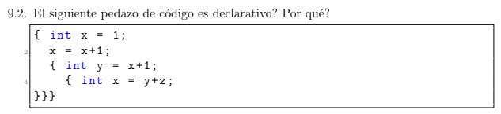
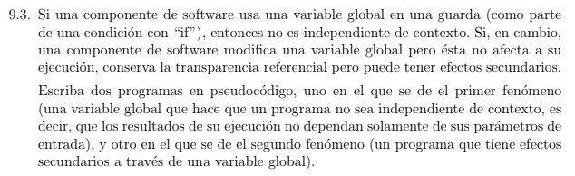
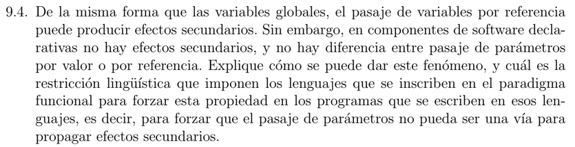
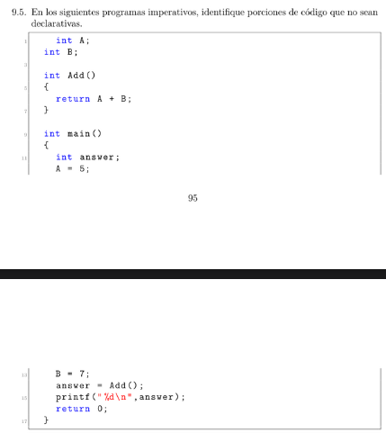
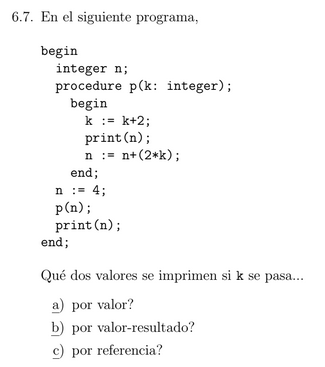

# Ejercicio 5.1


```
10 i = 0
20 do {
30   i = i + 1
40   PRINT i; " squared = "; i * i 
50 }
60 if (i < 10) {
70   PRINT "Program Completed"
80 }
90 END
```

# Ejercicio 5.3


```
[]

[c1, res, n]

[c1, res, n, n-1, sum(n-1)]

[c1, res, n, n-1, sum(n-1), c1, res, n]

[c1, res, n, n-1, sum(n-1), c1, res, n, n-1, sum(n-1)]

[cl, res, n, n-1, sum(n-1), cl, res, n, n-1, sum(n-1), cl, res, n]

[cl, res, n, n-1, sum(n-1), cl, res, n, n-1, sum(n-1), cl, res, n, n-1, sum(n-1)]

[cl, res, n, n-1, sum(n-1), cl, res, n, n-1, sum(n-1), cl, res, n, n-1, sum(n-1), cl, res, n]

[cl, res, n, n-1, sum(n-1), cl, res, n, n-1, sum(n-1), cl, res, n, n-1, sum(n-1), cl, res, n, n-1, sum(n-1)]

[cl, res, n, n-1, sum(n-1), cl, res, n, n-1, sum(n-1), cl, res, n, n-1, sum(n-1), cl, res, n, n-1, sum(n-1), cl, res, n]

[cl, res, n, n-1, sum(n-1), cl, res, n, n-1, sum(n-1), cl, res, n, n-1, sum(n-1), cl, res, n, n-1, sum(n-1)]

[cl, res, n, n-1, sum(n-1), cl, res, n, n-1, sum(n-1), cl, res, n, n-1, sum(n-1)]

[cl, res, n, n-1, sum(n-1), cl, res, n, n-1, sum(n-1)]

[cl, res, n, n-1, sum(n-1)]

[]
```

# Ejercicio 9.1


RT es transparente referencialmente.

# Ejercicio 9.2



No lo es ya que tiene asginaciones

* Observacion:

        - **Declarativo**: "Lo que quiero".

        - **Imperativo**: "Como lograrlo".

# Ejercicio 9.3



* Primer fenomeno (No transparente referencialmente):

```
int g;
int f(int x){
    return g + x;
}
```

* Segundo fenomeno (Con efectos secundarios):

```
ing g;
int f(int x) {
    g = x;
    return x * 2;
}
```

# Ejercicio 9.4



Hacen que todas las expresiones sean declarativas

# Ejercicio 9.5




* Primer codigo:

```
int A;
int B;
int Add() {
    ""return A + B;"" ---> Usa variables globales, como la funcion no recibe parametros, solamente depende del estado global del programa (no declarativo). Una funcion DECLARATIVA/FUNCIONAL deberia depender unicamente de sus entradas.
}
int main() {
    int answer;
    ""A = 5;"" ---> Asignaciones a variables globales (no declarativo)
    ""B = 7;"" ---> Lo mismo de arriba
    ""answer = Add();"" ---> Llama a una funcion que usa ese estado global
    ""printf(" %d \ n ", answer);"" ---> Tiene un efecto observable en el exterior (output), por lo tanto tambien es un efecto secundario (no declarativo)
    return 0;
}
```
Parte NO declarativo esta entre "".

* Segundo codigo:

```
int glob = 0;
int square(int x) {
    ""glob = 1;"" ---> Modifica una variable global dentro de una funcion (no declarativo)
    return x * x;
}
int main() {
    int res;
    ""glob = 0;"" ---> otra asignacion global
    ""res = square(5);"" ---> Llama a una funcion que cambia el estado global
    ""res += glob;"" ---> Dependencia del estado glob, que fue alterado dentro de la funcion square
    ""return res;"" ---> Depende de un valor (res) "contaminado" por mutaciones previas, por lo que se considera no declarativa
}
```
Partes NO declarativo esta entre ""


# Pasaje de Parametros

## Ejercicio 6.7



a) Por valor:

Significa que `k` es una copia de `n`, y los cambios de `k` no afectan a `n`.

* Al entrar a `p(n)`, `k = 4`

* Se incrementa en 2, `k = 6`

* El `print(n)` --> `4`

* Luego `n = 4 + 2 * 6 = 16`

* Por ultimo `print(n)` --> `16`

Por lo que la respuesta es `4` y `16`.

b) Por valor-resultado:

Esto es como por valor pero se copia al inicio y al final se copia de vuelta al argumento original (osea, se sincroniza `k->n` al final del procedimiento).

* Al entrar a `p(n)`, `k = 4`

* Se incrementa en 2, `k = 6`

* El `print(n)` --> `4`

* Luego `n = 4 + 2 * 6 = 16`

* Antes de salir de `p`, `k` (vale 6) se copia de vuelta a `n`

* => `n = 6`

* Por ultimo `print(n)` --> `6`

Por lo que la respuesta es `4`, `6`

c) Por referencia:

Ahora `k` es literalmente `n`, asi que cualquier cambio en `k` afecta a `n` directamente.

* Al entrar a `p(n)`, `k = n = 4`

* Se incrementa en 2, `k = 6` => `n = 6`

* El `print(n)` --> imprime `6`

* Luego `n = 6 + 2 * 6 = 18`

* Por ultimo `print(n)` --> imprimira `18`

Por lo que la respuesta es `6`, `18`.
