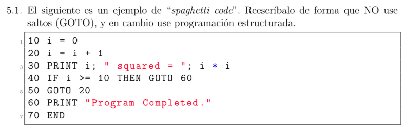
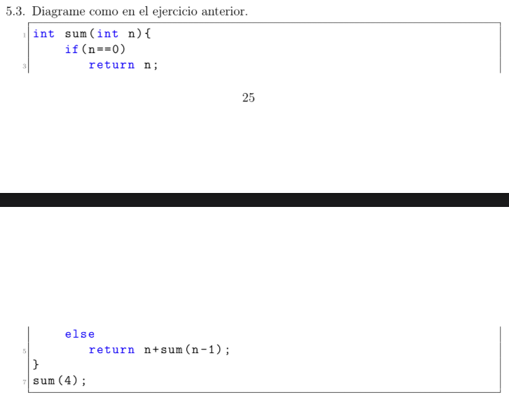

# Ejercicio 5.1



```
10 i = 0
20 do {
30   i = i + 1
40   PRINT i; " squared = "; i * i 
50 }
60 if (i < 10) {
70   PRINT "Program Completed"
80 }
90 END
```

# Ejercicio 5.3



```
[]

[c1, res, n]

[c1, res, n, n-1, sum(n-1)]

[c1, res, n, n-1, sum(n-1), c1, res, n]

[c1, res, n, n-1, sum(n-1), c1, res, n, n-1, sum(n-1)]

[cl, res, n, n-1, sum(n-1), cl, res, n, n-1, sum(n-1), cl, res, n]

[cl, res, n, n-1, sum(n-1), cl, res, n, n-1, sum(n-1), cl, res, n, n-1, sum(n-1)]

[cl, res, n, n-1, sum(n-1), cl, res, n, n-1, sum(n-1), cl, res, n, n-1, sum(n-1), cl, res, n]

[cl, res, n, n-1, sum(n-1), cl, res, n, n-1, sum(n-1), cl, res, n, n-1, sum(n-1), cl, res, n, n-1, sum(n-1)]

[cl, res, n, n-1, sum(n-1), cl, res, n, n-1, sum(n-1), cl, res, n, n-1, sum(n-1), cl, res, n, n-1, sum(n-1), cl, res, n]

[cl, res, n, n-1, sum(n-1), cl, res, n, n-1, sum(n-1), cl, res, n, n-1, sum(n-1), cl, res, n, n-1, sum(n-1)]

[cl, res, n, n-1, sum(n-1), cl, res, n, n-1, sum(n-1), cl, res, n, n-1, sum(n-1)]

[cl, res, n, n-1, sum(n-1), cl, res, n, n-1, sum(n-1)]

[cl, res, n, n-1, sum(n-1)]

[]
```