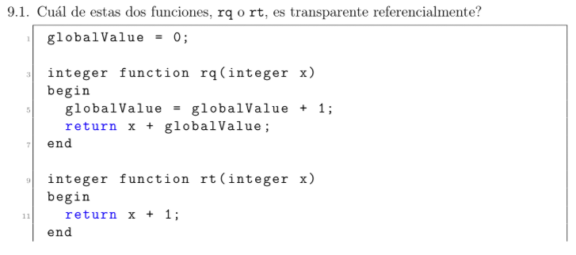
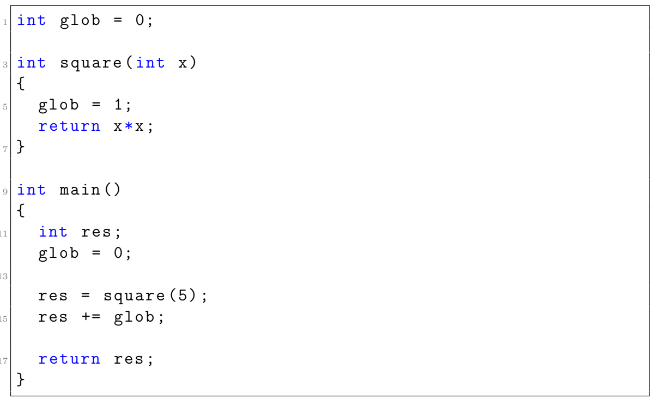
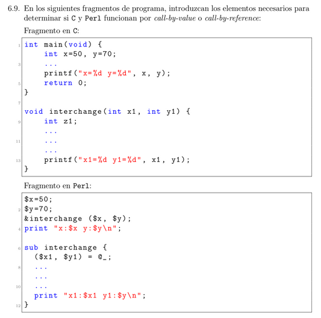

# Ejercicio 5.1


```
10 i = 0
20 do {
30   i = i + 1
40   PRINT i; " squared = "; i * i 
50 }
60 if (i < 10) {
70   PRINT "Program Completed"
80 }
90 END
```

# Ejercicio 5.3


```
[]

[c1, res, n]

[c1, res, n, n-1, sum(n-1)]

[c1, res, n, n-1, sum(n-1), c1, res, n]

[c1, res, n, n-1, sum(n-1), c1, res, n, n-1, sum(n-1)]

[cl, res, n, n-1, sum(n-1), cl, res, n, n-1, sum(n-1), cl, res, n]

[cl, res, n, n-1, sum(n-1), cl, res, n, n-1, sum(n-1), cl, res, n, n-1, sum(n-1)]

[cl, res, n, n-1, sum(n-1), cl, res, n, n-1, sum(n-1), cl, res, n, n-1, sum(n-1), cl, res, n]

[cl, res, n, n-1, sum(n-1), cl, res, n, n-1, sum(n-1), cl, res, n, n-1, sum(n-1), cl, res, n, n-1, sum(n-1)]

[cl, res, n, n-1, sum(n-1), cl, res, n, n-1, sum(n-1), cl, res, n, n-1, sum(n-1), cl, res, n, n-1, sum(n-1), cl, res, n]

[cl, res, n, n-1, sum(n-1), cl, res, n, n-1, sum(n-1), cl, res, n, n-1, sum(n-1), cl, res, n, n-1, sum(n-1)]

[cl, res, n, n-1, sum(n-1), cl, res, n, n-1, sum(n-1), cl, res, n, n-1, sum(n-1)]

[cl, res, n, n-1, sum(n-1), cl, res, n, n-1, sum(n-1)]

[cl, res, n, n-1, sum(n-1)]

[]
```

# Ejercicio 9.1



RT es transparente referencialmente.

# Ejercicio 9.2


No lo es ya que tiene asginaciones

* Observacion:

        - **Declarativo**: "Lo que quiero".

        - **Imperativo**: "Como lograrlo".

# Ejercicio 9.3


* Primer fenomeno (No transparente referencialmente):

```
int g;
int f(int x){
    return g + x;
}
```

* Segundo fenomeno (Con efectos secundarios):

```
ing g;
int f(int x) {
    g = x;
    return x * 2;
}
```

# Ejercicio 9.4


Hacen que todas las expresiones sean declarativas

# Ejercicio 9.5




* Primer codigo:

```
int A;
int B;
int Add() {
    ""return A + B;"" ---> Usa variables globales, como la funcion no recibe parametros, solamente depende del estado global del programa (no declarativo). Una funcion DECLARATIVA/FUNCIONAL deberia depender unicamente de sus entradas.
}
int main() {
    int answer;
    ""A = 5;"" ---> Asignaciones a variables globales (no declarativo)
    ""B = 7;"" ---> Lo mismo de arriba
    ""answer = Add();"" ---> Llama a una funcion que usa ese estado global
    ""printf(" %d \ n ", answer);"" ---> Tiene un efecto observable en el exterior (output), por lo tanto tambien es un efecto secundario (no declarativo)
    return 0;
}
```
Parte NO declarativo esta entre "".

* Segundo codigo:

```
int glob = 0;
int square(int x) {
    ""glob = 1;"" ---> Modifica una variable global dentro de una funcion (no declarativo)
    return x * x;
}
int main() {
    int res;
    ""glob = 0;"" ---> otra asignacion global
    ""res = square(5);"" ---> Llama a una funcion que cambia el estado global
    ""res += glob;"" ---> Dependencia del estado glob, que fue alterado dentro de la funcion square
    ""return res;"" ---> Depende de un valor (res) "contaminado" por mutaciones previas, por lo que se considera no declarativa
}
```
Partes NO declarativo esta entre ""


# Pasaje de Parametros

## Ejercicio 6.7


#### a) Por valor:

Significa que `k` es una copia de `n`, y los cambios de `k` no afectan a `n`. La funcion no puede cambiar el valor de la variable de la funcion que llama

* Al entrar a `p(n)`, `k = 4`

* Se incrementa en 2, `k = 6`

* El `print(n)` --> `4`

* Luego `n = 4 + 2 * 6 = 16`

* Por ultimo `print(n)` --> `16`

Por lo que la respuesta es `4` y `16`.

#### b) Por valor-resultado:

Esto es como por valor pero se copia al inicio y al final se copia de vuelta al argumento original (osea, se sincroniza `k->n` al final del procedimiento). Dentro de la funcion se trabaja como si los argumentos hubieran sido pasados por valor, pero al acabar la funcion los valores que tengan los argumentos seran copiados a la ubicacion de memoria en la que se ubicaba el valor copiado inicialmente.

* Al entrar a `p(n)`, `k = 4`

* Se incrementa en 2, `k = 6`

* El `print(n)` --> `4`

* Luego `n = 4 + 2 * 6 = 16`

* Antes de salir de `p`, `k` (vale 6) se copia de vuelta a `n`

* => `n = 6`

* Por ultimo `print(n)` --> `6`

Por lo que la respuesta es `4`, `6`

#### c) Por referencia:

Ahora `k` es literalmente `n`, asi que cualquier cambio en `k` afecta a `n` directamente. La funcion que es llamada puede modificar la variable con efecto en el bloque que llama a la funcion

* Al entrar a `p(n)`, `k = n = 4`

* Se incrementa en 2, `k = 6` => `n = 6`

* El `print(n)` --> imprime `6`

* Luego `n = 6 + 2 * 6 = 18`

* Por ultimo `print(n)` --> imprimira `18`

Por lo que la respuesta es `6`, `18`.

## Ejercicio 6.8


Tome `k` como el tercer parametro.

#### a) Por valor:

La funcion no puede cambiar el valor de la variable de la funcion que llama. Cualquier cambio a `z` dentro de `p` no afecta a `a+c` afuera.

* `c:= 5;` --> local.

* `x:= z;` --> `x:= 3` (`= 2+1 = a+b`).

* `c:= 4` --> local.

* `y:= z+a` --> `3+2=5`

Como `y` es local, `b` no cambia, asi que `print(b)` sigue siendo `4`.

#### b) Por valor-resultado:

Dentro de la funcion se trabaja como si los argumentos hubieran sido pasados por valor, pero al acabar la funcion los valores que tengan los argumentos seran copiados a la ubicacion de memoria en la que se ubicaba el valor copiado inicialmente. Se copia al inicio y al final se copia de vuelta al argumento original.

Valor original: `a+c=3` se copia al **entrar**

* `x:= z` --> `x=3`

* `y:= z+a` --> `3+2=5`

* Al salir, `y` **se copia a** `b` (porque `y` es el segundo parametro, que si es `b`)

* Y `z` **se copia de regreso a** `a+c`. Pero `a+c` no existe afuera, es una expresion. En valor-resultado lo que hace es **almacenar la posicion de** `a+c` **al entrar** (pero `a+c` no tiene direccion valid). En estos casos, esto es **indefinido**.

* Si `a+c` es tratado como temporal => no se copia nada.

* Si fuera `k` una variable real => se copiaria su valor actualizado.

Asumiendo que no se actualiza nada, como `y=b=4` entra y `y=5` se sale, entonces `print(b)` imprime `5`.

#### c) Por referencia:

La funcion que es llamada puede modificar la variable con efecto en el bloque que llama a la funcion.

`a+c=3`, por referencia no se puede pasar una expresion, solo una variable. Asi que **esto seria invalido** xd.

## Ejercicio 6.9



#### Fragmento en C

En C todo se pasa por **valor**, salvo que usemos punteros.

```c
void interchange(int x1, int y1){
    int z1;
    z1 = x1;
    x1 = y1;
    y1 = z1;

    printf("x1 = %d, y1 = %d\n", x1,y1);
}

int main(){
    int x = 50, y = 70;

    interchange(x, y); //Aca se pasan **copias** de x e y.

    printf("x = %d, y = %d\n", x,y);

    return 0;
}
```

* `interchange(x, y)` recibe **copias** de `x` e `y`.

* Copian los valores de las copias, pero **los originales no cambian**.

* Lo que imprime es:

```shell
x1 = 70, y1 = 50
x = 50, y = 70
```

#### Fragmento en Perl

En Perl, las variables se pasan **Por referencia** implicita cuando se usa `@_` (el arreglo de los parametros) (Fuente chatGPT)

```perl
$x = 50;
$y = 70;

&interchange($x, $y);
print "x:$x y:$y\n";

sub interchange {
    ($x1, $y1) = @_;
    my $z1 = $$x1;  # desreferenciar
    $$x1 = $$y1;
    $$y1 = $z1;
    print "x1:$$x1 y1:$$y1\n";
}
```

* `@_` recibe **referencias a las variables**.

* Si modifica `$$x1` o `$$y1`, se modifica **las variables originales**.

* Lo que imprime es:

```shell
x1:70 y1:50
x:70 y:50
```
