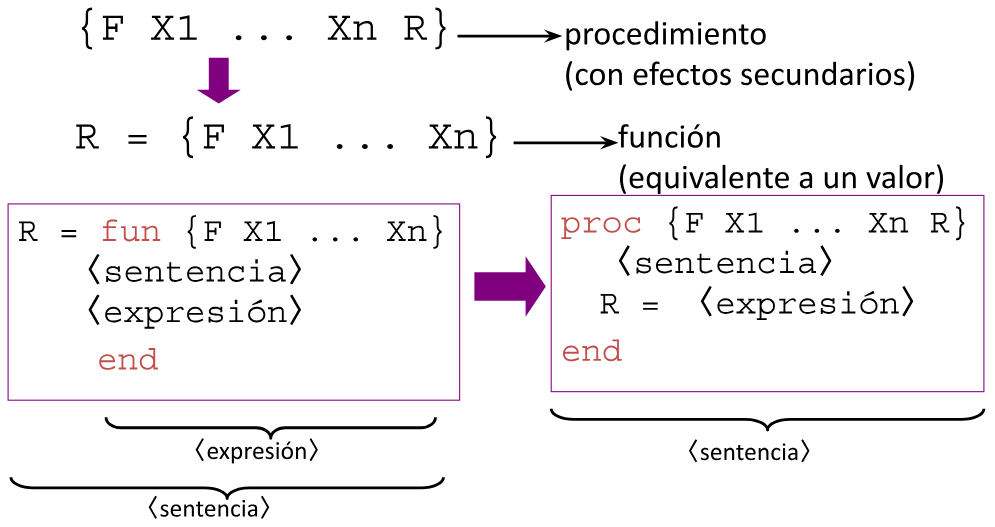
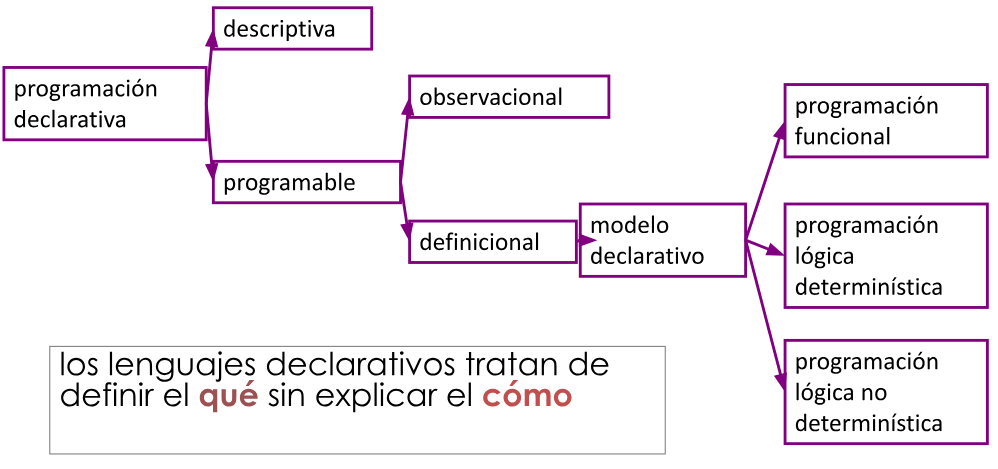

# Comparacion Funcional - Imperativo

## Declarativo vs. Imperativo

* Las construcciones mas primitivas son **Imperativas**:
```
"Traeme esa manzana"
x: = 5
```

* Abstraccion: Las **Declarativas** describen un hecho.
```
"La tierra es redonda"
fuction f(int x) { return x+1; }
```

* Las construcciones **imperativas** **CAMBIAN** un valor y las **Declarativas** **CREAN** un nuevo valor.

## Asignaciones Destructivas

* La asignacion **Imperativa** puede introducir *efectos secundarios*: Puede destruir el valor anterior de una variable.

* En programacion **Funcional** se le llama *Asignacion Destructiva*.

## Operacion Declarativa

* Una operacion es **Declarativa** si siempre que la llamamos con los mismos argumentos devuelve los mismos resultados, independientemente del estado de la computacion.

* **La composicion de dos operaciones declarativas es declarativa**, por lo tanto, podemos crear grandes programas declarativos por composicion de operaciones declarativas.

* Una **operacion declarativa** es:

    - **Independiente**: Depende solo de sus Argumentos.

    - **Sin estado**: No recuerda ningun estado entre llamados.

    - **Deterministica**: Los llamados con los mismos argumentos siempre dan los mismos resultados.

## Ventajas de los componentes Declarativos

* **Programacion a pequeña escala**: Es mas facil razonar sobre programas declarativos porque podemos usar tecnicas algebraicas y logicas.

* **Programacion a gran escala**: Una componente declarativa se puede escribir, testear y verificar independientemente de otras componentes.

* Como las componentens declarativas son funciones matematicas, se puede aplicar **Razonamiento algebraico**, sustituyendo iguales por iguales.

* Se puede escribir componentes declarativas en modelos que permiten tipos de datos con estado, pero perdemos la garantias de mantener declaratividad.

## Transparencia referencial

* Una expresion transparente referencialmente se puede sustituir por su valor sin cambiar la semantica del programa:

```
{ int x = 1;
    x = x+1;
    { int y = x+1;
        { int z = y+1;
}}}

Es lo mismo que

{ int x = 1;
    x = x+1;
    { int y = x+1;
        { int x = y+1;
}}}
```

* Todas las componentes declarativas, independientemente de su estructura, se pueden usar como valores:
    
    - Como argumentos de funcion.

    - Como resultados de funcion.

    - como partes de estructuras de datos.

## Traduccion de Imperativo a Declarativo



## Clasificacion de Lenguajes Declarativos



## Estado Explicito

* El estado de la computacion esta siempre, tambien en un programa funcional (se puede diagramar la computacion con los diferentes active records que se apilan y desapilan).

* Los programas imperativos integran el estado de forma explicita: variables globales, resultados temporales.

* Es mas adecuado hablar de componentes o programas imperativos y no lenguajes imperativos.

* Los lenguajes funcionales tambien incluyen formas de referirse al estado:

    - Monadas.

    - Pasar el estado como parametros.

## ¿Cuando queremos usar el estado explicito?

* Cuando queremos representar memoria.

* Cuando el entorno es determinante para el comportamiento de las componentes (agentes).

* Cuando la asignacion destructiva convierte en un problema intratable en tratable.

* Cuando queremos guardar resultados temporales (por ejemplo: en programacion dinamica)
    
    - Encontrar el camino mas corto (Dijkstra) (sabemos cual es el camino mas corto entre los puntos intermedios).

    - Fibonacci.

    - alineamiento de secuencias (distancia de edicion).

    - Torres de hanoi.

    - Multiplicacion de matrices.

## Monadas

* Muchos lenguajes funcionales "puros" proveen algun tipo de construccion linguistica para poder expresar instrucciones imperativas: las monadas.

* Crear un alcance aislado del resto del programa.

* Se permiten ciertas operaciones con efectos secundarios: variables globales, asignacion destructiva.

* "Puntos y coma programable", que transportan datos entre unidades funcionales.

## Concurrencia declarativa

* Paralelizar programas declarativos es trivial: Las componentes declarativas se pueden ejecutar de forma concurrente sin que se den condiciones de carrera.

* Algunas paralelizaciones son absurdas:

    - Existe dependencia entre resultados.

    - El *overhead* es demasiado alto para la ganancia obtenida.
