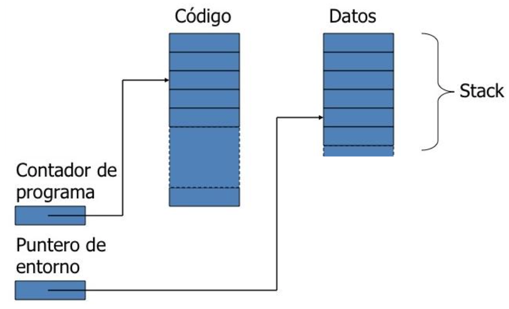
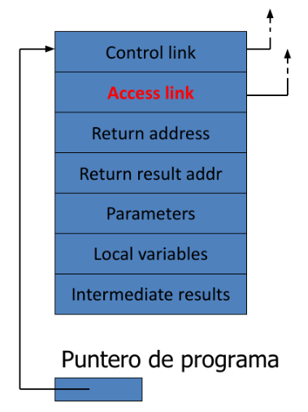

## Lenguaje objeto y metalenguajes

* El **metalenguaje** es el que usamos para hablar de un **lenguaje objeto**.

* Necesitamos un lenguaje para hablar de la semantica de los lenguajes de programacion.

# Semantica

## Delimitacion de la semantica de los lenguajes de programacion

* Los programas pueden definir **funciones parciales**

    - Algunos de sus valores pueden **indefinidos** (por ejemplo si no terminan).

    - Algunos de sus valores pueden ser **errores**.

* Intuituvamente, una funcion es computable si hay algun programa que la computa

    - Problema: definicion dependiente de la implementacion de un lenguaje de programacion concreto, con sus limitaciones y particularidades

## ¿Como definir la clase de funciones computables?

* Una clase de funciones matematicas: las **funciones recursivas parciales** (Church).

* Las que se pueden computar con una máquina idealizada, abstracta: la **Maquina de turing**.

* Si se puede expresar en **lambda calculo**.

## Semantica operacional

* Una representacion abstracta de la ejecucion de un programa, como secuencia de transiciones entre estados (en una maquina abstracta).

* Los estados son una descripcion abstracta de la memoria y estructura de datos.

* Las transiciones siguen la estructura de la sintaxis.

## Maquina abstracta

* Separa memoria de codigo y de datos

    - **contador de programa**: Direccion de memoria con la instruccion que se está ejecutando.

    - **Puntero de entorno**: valores de las variables en una parte del codigo, apunta a la ubicación actual en el stack, y permite saber los valores de las variables en una parte del código (buscando los valores en ese activation record, o subiendo por la pila).

* **Lenguajes no estructurado por bloques**: la memoria de datos es no estructurada, los valores de las variables son visibles desde todo el codigo.

* **Lenguaje estructurados por bloques**: **Pila de ejecucion** o **stack**. Cuando el programa entra en un nuevo bloque, se agrega a la pila un **Activation record** con espacios para las variables locales del bloque, y el puntero de entorno apunta al nuevo activation record. Cuando el programa sale del bloque, se retura el activation record de la pila y el puntero de entorno se establece a su ubicacion.

## Pila de ejecucion

* Los registros de activacion se guardan en la pila

    - Cada nuevo bloque apila (*push*) un nuevo registro de activacion en la pila.

    - Cada vez que se termina un bloque se saca (*pop*) el registro de arriba de la pila.

    - La pila tiene todos los registros que son activos en un determinado momento de la ejecucion, con el que se uso mas recientemente en la punta.

## Registros de activacion o marcos de pila (*Activation Record* o *stack frames*)

* **Activation records** (*stack frames*) que se apilan y desapilan según la estructura de bloques. Son estructuras de datos que cada puede contener:

    - **Control link**: Puntero al activation record que anterior en la pila. Será el puntero de entorno al desapilar el activation record actual.

        * **Apilar** un record en la pila:

            - Fijar el nuevo control link para que apunte al viejo puntero de entorno.

            - Dijar el puntero de entorno al nuevo record.

        * **Desapilar** un record de la pila:

            - Seguir el control link del record actual para reasignar el punetor de entorno.

    - **Access link**: Puntero al activation record más cercano que lo contiene (en la estructura de bloques) en el texto del programa (diferente al control link para llamadas a funciones declaradas con más anterioridad)

    - Los valores de las variables declaradas localmente y de los parámetros/argumentos que toma la función/declaración (su L o R valor según el tipo de pasaje de parámetros que se use, el cual puede ser una clausura). Por ello el tamaño del activation record depende de las estructuras de datos usadas y de la función declarada/llamada (de la cantidad y tipos de sus variables y argumentos).

    - **Resultados intermedios**.

    - **Dirección de retorno**: Puntero a la ubicación del código a ejecutar cuando retorne la función.

    - **Dirección de resultado de retorno**: Puntero al lugar en el que será almacenado el resultado de la función una vez calculada esta (si es que existe)

Su estructura de pila permite instanciar variables locales, el uso de argumentos distintos para cada llamada de función, y la posibilidad de realizar llamadas recursivas en las funciones.

    