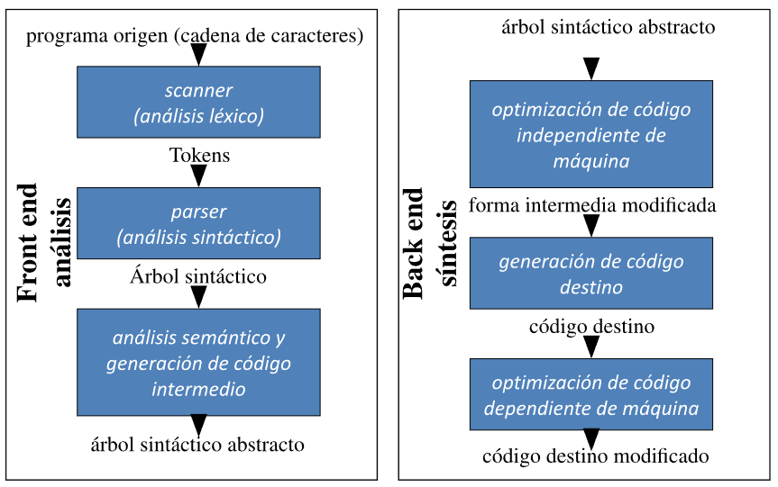

## Programa: Sintaxis y semantica

* Un programa es la descripcion de un proceso dinamico.

    - **Sintaxis**: texto del programa.

    - **Semantica**: cosas que hace.

* La **Implementacion** de un lenguaje de programacion debe transformar la sintaxis de un programa en instrucciones de maquina que se puede ejecutar para que suceda la secuencia de acciones que se pretendia.

## Transformacion de sintaxis a semantica

Un lenguaje de programacion es un conjunto de abstracciones y empaquetamiento quizas sin correspondencia directa con la máquina

* Es necesario **Traducir** lenguaje de programacion a instrucciones de maquina.

* El **compilador** hace esa Traduccion.

* Un **intérprete** puede combinar traduccion y ejecucion.

# Sintaxis

## Compilador (o intérprete)

* El compilador se encarga de procesar la sintaxis de los lenguajes de programacion

* Un intérprete incluye un compilador y la ejecucion

## ¿Que es un compilador?

Un programa que lee un programa escrito en un lenguaje origen y lo traduce a un programa equivalente (con el mismo significado) en un lenguaje destino.

* Tiene dos componentes:

    - Entender el programa (asegurarse de que es correcto).

    - Reescribir el programa.

* normalmente, el lenguaje origen es de alto nivel y el destino es de bajo nivel.

## Front-end y Back-end

## Scanner: Análisis lexico

* Se divide un programa (secuencia de caracteres) en palabras (tocken)

* Agarra la cadena de caracteres, identifica palabras, chequea que las palabras pertenezcan al lenguaje.

## Parser: Análisis sintactico

* Comprueba si la secuencia de tockens conforma a la especificacion gramatical del lenguaje y genera el arbol sintactico

* La especificacion gramatical suele representarse con una gramatica independiente de contexto (*context free grammar*), que tambien le da forma al arbol sintactico.

## Analisis semantico

* El compilador trata de ver si un programa **tiene sentido** analizando su arbol sintactico.

* Un programa sin errores gramaticales no siempre es correcto, puede haber problemas de tipo.

* El compilador hace comprobaciones semanticas **Estaticas** (*static semantic checks*)

    - Comprobaciones de tipos.

    - Declaraciones de variables antes de su uso.

    - Se usan los identicadores en contextos adecuados.

    - Comprobar argumentos.

    - Si hay un fallo en compilacion, se genera un **error**.

* En **tiempos de ejecucion** (*dynamic semantic checks*) se comprueba:

    - Que los valores de los arreglos esten dentro de los límites.

    - Errores aritmeticos (division por 0).

    - No se desreferencian los punteros si no apuntan a un objeto valido.

    - Se usan variables sin inicializacion.

    - Si hay un fallo en ejecucion, se levanta una **expepcion**.

## Tipado fuerte

* Un lenguaje tiene tipado fuerte si siempre se detectan los errores de tipo

    - En tiempo de compilacion o de ejecucion.

    - Ejemplo de lenguajes con tipado fuerte: Ada, Java, ML, Haskell.

    - Ejemplos de lenguajes con tipado debil: Fortran, Pascal, C/C++, Lisp.

    - *duck typing*: Python.

* El tipado fuerte hace que el lenguaje sea mas seguro y facil sin errores, pero potencialmente mas lento por las comprobaciones dinamicas.

* En algunos lenguajes algunos errores de tipo se detectan tarde, lo que los hace poco fiables.

## Gramaticas y arboles sintactico

Una gramatica:

* Es un metodo para:

    - Definir conjuntos infinitos de expresiones.

    - Procesar expresiones.

* Consiste de:

    - Simbolo inicial.

    - No terminales.

    - Terminales.

    - Producciones.

## Gramaticas como metodos

* No terminales:

    - Forma adecuada de describir la composicionalidad de las expresiones.

    - No pueden formar parte de una expresion, siempre se tienen que substituir por terminales.

* Derivacion: Secuencia de sustituciones que termina en una cadena de terminales